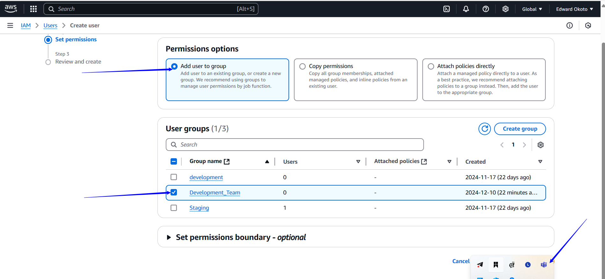
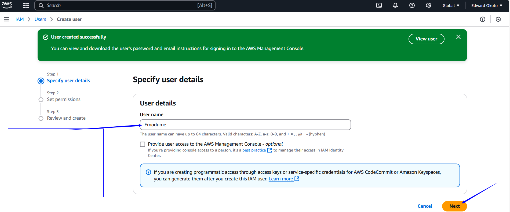

# AWS Identity & Access Management (IAM)
## Project Goals
   * Understand AWS identity and Access management (IAM) principles and components.

   * Learn to create and manage IAM policies for regulating access to AWS resources securely.

   * Apply IAM concept practically to control access with IAM environment

   * Explore best practises for IAM implementation and security in AWS.

### Learning Outcomes
* Recognise IAM components like users,roles,policies and groups.
* Create and manage IAM policies to define permissions for users and roles.
* Set-up IAM users,groups,and roles to control access to AWS services.
* Understand IAM best practises for maintaining security and managing access to AWS resources.

### WHAT IS IAM ?
IAM stands for Identity and Access Management. It's a framework of policies and technologies that ensure the right users have appropriate access to technology resources. Here are some key points about IAM:

* Identity Management: This involves creating and managing digital identities for users, such as employees, contractors, and devices.

* Access Management: This controls what resources users can access and what they can do with those resources.

* Authentication: Verifying the identity of a user, often through methods like passwords, biometrics, or multi-factor authentication (MFA).

* Authorization: Determining what resources and actions a verified user is allowed to access and perform.

IAM systems help organizations secure their data and resources by ensuring that only authorized users can access sensitive information and perform specific tasks

### WHAT IS IAM USER ?

An IAM user is a type of identity used in Identity and Access Management (IAM) systems to manage access to resources within an organization. In the context of services like AWS (Amazon Web Services), an IAM user is an entity that you create in your AWS account to represent a person or an application that interacts with AWS resources.Here are some key points about IAM users:

* Unique Credentials: Each IAM user has unique credentials, which can include a username, password, and access keys.

* Permissions: IAM users can have specific permissions assigned to them through policies, which define what actions they can perform on which resources.

* Security: By using IAM users, you can avoid sharing the root account credentials and grant specific permissions to individual users or applications.

* Groups: IAM users can be grouped together, and permissions can be applied at the group level for easier management.

IAM users are essential for fine-grained access control and security in cloud environments, ensuring that only authorized users can access and perform specific actions on resources.

### WHAT IS IAM ROLE
An IAM role is an identity in Identity and Access Management (IAM) that you can create in your account to grant specific permissions to perform a set of actions. Unlike IAM users, roles do not have long-term credentials like passwords or access keys. Instead, they provide temporary security credentials for trusted entities to perform specific tasks.
Here are some key features of IAM roles:

* Temporary Credentials: Roles use temporary security credentials, which can be used to access AWS resources.

* Delegation: Roles can be assumed by IAM users, applications, or services, allowing them to take on the permissions associated with the role.

* Cross-Account Access: Roles can be used to grant access to resources across different AWS accounts.

* Service Roles: Some roles are used by AWS services to perform actions on your behalf. For example, an Amazon EC2 instance can assume a role to access other AWS services.

* Least Privilege: Roles help enforce the principle of least privilege by granting only the permissions needed to perform specific tasks.

IAM roles are a powerful way to manage permissions and access within AWS, ensuring security and flexibility in resource management.

### WHAT IS IAM POLICY
An IAM policy is a JSON document used in Identity and Access Management (IAM) to define permissions and access controls for AWS resources. These policies specify the actions that are allowed or denied for users, groups, roles, or resources. Here are the key elements of an IAM policy:

* Version: Specifies the language version, usually  **"2012-10-17"**.

* Statement: One or more individual statements that define the permissions.

* Effect: Specifies whether the action is allowed **("Allow")** or denied **("Deny")**.

* Action: Lists the actions that are allowed or denied. For example, **"s3:ListBucket"** or **"ec2:StartInstances"**.

* Resource: Specifies the ARN (Amazon Resource Name) of the resource to which the actions apply.

* Condition: (Optional) Specifies conditions for when the policy is in effect.

Example of IAM policy 

### WHAT IS IAM GROUP

An IAM group is a collection of IAM users in AWS (Amazon Web Services) that share the same set of permissions. Groups simplify the management of permissions by allowing you to apply policies to multiple users at once rather than individually. Here are some key points:

* Simplified Management: By placing users into groups, you can manage their permissions collectively.

* No Credentials: Groups themselves do not have credentials. They are used solely for organizing users and assigning permissions.

* Policy Assignment: You can attach IAM policies to groups, and all users in the group inherit the permissions specified by the policies.

* Hierarchical Organization: Groups can be used to reflect the organizational hierarchy, such as "Developers," "Administrators," or "Support Team."

Example Use Case:
If you have a team of developers, you can create a "Developers" group and assign permissions to access development resources. Any user added to the group will automatically get those permissions, making it easier to manage access control.

Best Practises:
* Give only the permissions needed: Dont give more access than neceessary
* Use roles instead of users : Roles are safer and can be used when needed.
* Review roles regularly: Remove unused roles to keep things tidy and secure
* Add extra security with MFA : Used multi-factor authentication for extra protection.
* Use ready-made policies: they are safer and easier to use.
* Keep policies simple : Make seperate policies for different tasks.
* Keep track of changes : Keep a record of who changes what.
* Test policies before using them :Make sure they work the way you want them before applying them to real stuff.

### TICKET:
A growing marketing company called GettoBusinessGrowFast.com wants to give access to their employee named Trinity, Tekeme and Emodume to their AWS resources.
 * Create a policy granting full access to the companys EC2 AWS resource.
 * Create a user Trinity and attach that policy to him.
 * Create a group and add user Tekeme and Emodume to it.
 * Create a policy for granting full access to EC2 and S3 resources and attach it to the group.

 ### Procedure
 * Login to AWS account and navigate to the AWS management console.

   a) use the search bar to locate the identity and access management(IAM) service.

   
* On the IAM dashboard, navigate to the left sidebar and click on *Policies*
 
  
  

  a) from there,search "EC2" and select "AmazonEC2FullAccess" from the list of policies.
  b) Proceed by clicking on "Create Policy" to initiate the policy creation process.

  

* Choose EC2 from the "Select a Service" dropdown

  

* Select all EC2 actions.
  

* On "Resources" select "all" and click "Next" button.

  

* Name the policy and click "Create Policy" at the bottom of the page.

  

  This is the policy created.

  

* Click "Users" in the user section and then click "Create User"

  

* Enter the username Trinity.

* a) Select the "Provide user access to the AWS Management Console" if access to the web-console interface is needed.
* b) Proceed to set-up a password for the user.
* c) Check the box "Users must create a new password at next sign-in - Recommended" if allowing users to change their password upon first sign-in is desired and click Next.

   

* select "Attach policy directly" and navigate to filter "custom managed policies"
* Choose the created policy "policy_for_Trinity" and click Next

* Notes: AWS policies

  Managed policies: Made by AWS,used by many.

  Customer managed policies: You maked and manage them

  Inline Policies : Made for one specific thing.

* Click "Create User"

  

* Ensure to save these details securely for future reference.

  

* Click on "Return to Users List"

  

Trinitys access has been successfully created and the policy granting him full access to ECS has been attached.

NEXT.

* Click on ""User groups" section and click "Create group"

  

  a) Click on "Create User group"

  b) Then proceed to the "users" section

  
  

 
  This is the user group created.

  

   c)Now, Lets proceed to "Users" selection and create a user called Tekeme.
   Click create user ,then give it name "Tekeme" and click Next.

   
   

* In the "Permissions" option, select "Add user to group"
* Attach the user Tekeme to the Development_Team, then click Next.
Review details and click create user.

  
  

* This is the user named Tekeme attached to the Development_Team.

  

* Repeat same process for user named Emodume.

  Lets proceed to "Users" selection and create a user called Emodume.
   Click create user ,then give it name "Emodume" and click Next.

   

* In the "Permissions" option, select "Add user to group"
* Attach the user Emodume to the Development_Team, then click Next.
Review details and click create user.

  
  

* This is the user named Emodume attached to the Development_Team.

  

* Navigate to the "Policies" section and click "Create policy"

* Choose the two services EC2 and S3 from the available options and click Next.

  
  

* Enter the desired Policy name and proceed to click on the "Create policy" button.

  

* Click on view policy to view the policy just created.

* Navigate to the "user group" section and click "Development_Team" group.

  
* Navigate to "Permission" section and add neccessary permissions.

  

* Click on "Attach policy"

  

* Select the "Custom managed" as policy type
* Choose development_Team_Policy and click "Attached polices"

  

* The policy is now attached to the Development group, granting full access to the development_Team group users.

  

## Project Reflections:

* **Understanding IAM** : IAM serves as the security foundation for AWS resources, controlling access and permissions.

* **Security Importance** : IAM ensures data protection, compliance and prevents unauthorized access.

* **Policy Creation** : Participants have learned how to craft IAM policies to regulate resources access effectively.

* **Practical Application** : Hands on exercises have equipped participant to set up IAM users,groups and roles enhancing real world implememtation skills.
